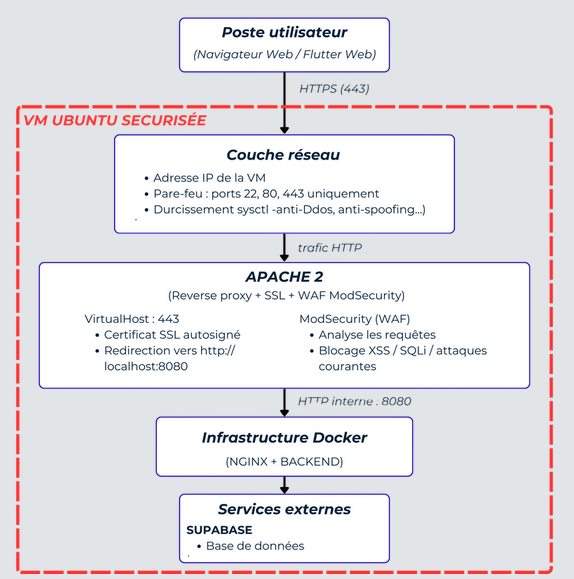

# FitLab

Application mobile de suivi sportif réalisée dans le cadre d’un projet universitaire.

FitLab permet de centraliser le suivi des entraînements, de la nutrition, des abonnements et de la relation coach/athlète. Le projet intègre également une réflexion sur l’infrastructure, le déploiement, la sécurité et la supervision.

## Fonctionnalités

- Suivi des entraînements
- Suivi nutritionnel
- Gestion des coachs et athlètes
- Gestion des abonnements
- Messagerie et demandes d’amis
- Authentification avec Supabase
- Déploiement avec Docker / Nginx
- Sécurisation réseau et applicative

## Technologies

- Flutter / Dart
- Supabase
- PostgreSQL
- Docker
- Nginx
- Ubuntu Server
- Prometheus / Grafana
- OWASP ZAP, Nikto, Wapiti

## Mon rôle

J’ai principalement travaillé sur la partie réseau, infrastructure et sécurité :

- architecture Docker
- reverse proxy Nginx
- isolation du backend
- configuration serveur Ubuntu
- durcissement SSH
- headers de sécurité
- tests de vulnérabilités
- supervision avec Prometheus / Grafana

## Ce que ce projet m’a apporté

Ce projet m’a permis de travailler sur une architecture complète, mêlant application mobile, backend, base de données, infrastructure et cybersécurité. Il m’a permis de renforcer mes compétences en Docker, Nginx, sécurisation serveur, supervision et bonnes pratiques de déploiement.

## Aperçu

### Page principale FitLab

  

### Nutrition

  

### Entrainements

  

### Abonnements

  

### Architecture réseau/sécu

  

